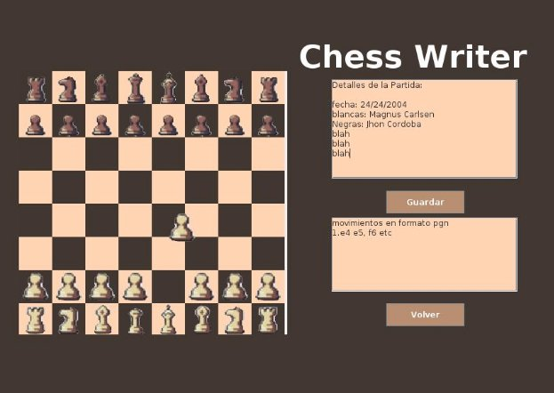
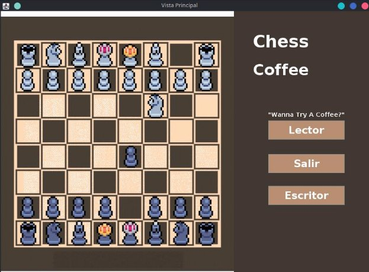
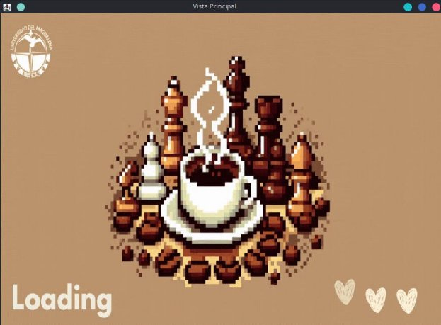
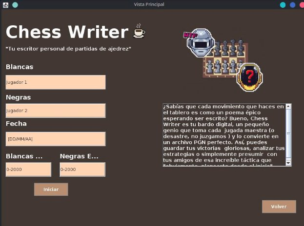
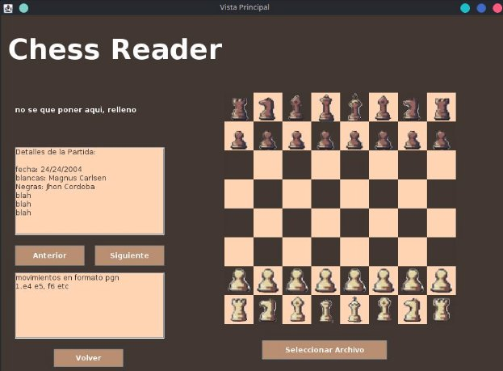
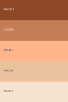
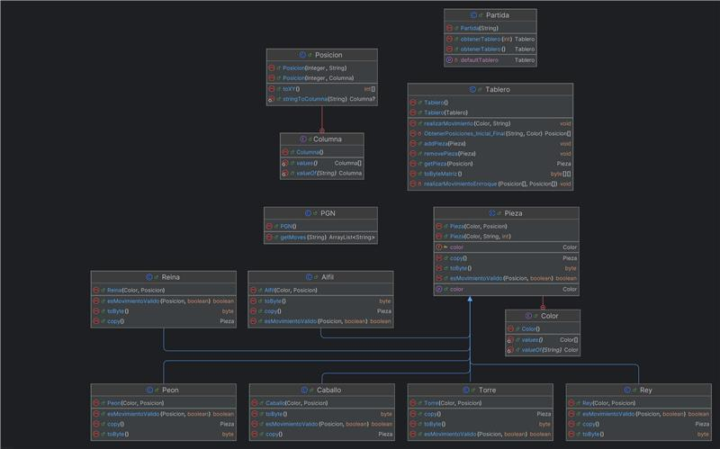

# PGN Reader and Writter
## Overview
This is a Java-based PGN (Portable Game Notation) chess game reader and writter
> Based in previus project [Chess_PGN_Reader](https://github.com/Camilo-845/Chess_PGN_Reader)

## Instalacion y uso
### Instalacion:
Descargar .zip del proyecto [link](https://github.com/Camilo-845/Chess_PGN_Reader_Writter/archive/refs/heads/main.zip)

o

Clonar Repositorio
```sh
  git clone https://github.com/Camilo-845/Chess_PGN_Reader_Writter.git
```
### Opcion 1 (NetBeans):
1. Abrir Proyecto del repositorio desde Netbeans
2. Ejecutar Ptoyecto

### Opcion 2 (JAR):
Usando [Chess.jar](./Chess.jar)
1. Abrir el proyecto en IntelliJ IDEA

Si ya tienes el proyecto en IntelliJ, abre el IDE y carga el proyecto. Si aún no tienes el proyecto en IntelliJ, puedes importar el proyecto existente usando:

  - Archivo > Nuevo > Proyecto desde el directorio (si no es un proyecto de IntelliJ aún).
  - Archivo > Abrir... y selecciona la carpeta del proyecto si ya es un proyecto de IntelliJ.
2. Configurar el JDK

Asegúrate de que tienes configurado un JDK adecuado:

  - Archivo > Estructura del Proyecto > Proyecto.
  - En "Proyecto SDK", selecciona la versión correcta del JDK. Si no tienes un JDK configurado, agrega uno desde esta pantalla.

3. Crear una configuración de ejecución

Necesitarás crear una configuración de ejecución para ejecutar el archivo JAR:

  - Ve a la parte superior derecha de la ventana de IntelliJ y haz clic en la lista de configuraciones (cerca del botón verde de "Run").
  - Haz clic en "Editar configuraciones...".
  - En la ventana de Configuraciones de ejecución, haz clic en el botón "+" y selecciona "Aplicación Java" (si no ves esta opción, busca la opción correcta dependiendo de tu configuración).

4. Configurar la ejecución del archivo JAR

En la nueva configuración de ejecución:

  - Nombre: Asigna un nombre a la configuración, por ejemplo, "Ejecutar JAR".
  - Clase principal: Aquí, necesitas seleccionar la clase que contiene el método main(). Si tu JAR está empaquetado correctamente, esta clase debe ser la que inicia el programa (por ejemplo, Main o cualquier otra clase con el main).
  - Ruta del archivo JAR: Si ya tienes el archivo JAR, puedes configurarlo como un artefacto dentro de IntelliJ.
  Para configurar el JAR de salida:

  - Ve a Archivo > Configuración del proyecto > Artefactos.
  - Haz clic en "+" y selecciona "JAR > Desde módulos con dependencia".
  - Elige el módulo principal y selecciona que el archivo JAR se genere con las dependencias adecuadas.
5. Seleccionar el JDK correcto

Asegúrate de que el JDK utilizado en la configuración de ejecución coincida con el que usas para compilar el JAR.

6. Ejecutar el JAR

Una vez que la configuración esté lista:

- Haz clic en el botón verde de Run en la parte superior derecha.
- Esto ejecutará el archivo JAR con la configuración especificada.

## Descripcion del proyecto


**Chess Coffee - Writer And Reader**

Comienzo del Proyecto: 18/11/2024

 **Distribución del Trabajo** 

Nombrer y rol dentro del desarrollo del trabajo. 

 **Integrantes**

| **Nombre**| **Rol** |
|-----------|-----------|
|   Samuel David Gil Cantillo |   Diseñador/VIsta/Flujo del Programa |
|   Camilo Esteban Sarmiento Amado|   Lógica, Estructura, Funcionalidad  |
|   Jhon David Aguirre Avendaño  |   Consultor Independiente, Solución de bugs, revisión final |


 **¿Como se implemento la funcionalidad de guardado en formato PGN?**

- **Generación de Archivos PGN desde la Vista**: Al ingresar las jugadas en la interfaz visual, el sistema no solo actualiza el tablero, sino que también puede generar un archivo PGN dinámicamente. Esto permite que los jugadores creen y compartan sus partidas en formato estándar sin necesidad de transcribir manualmente los movimientos.
- **Guardado Automático en Formato PGN**: Utilizando el poderoso  BufferedWriter de Java, cada movimiento realizado en la vista se guarda de manera automática en un archivo temporal. Este archivo se mantiene actualizado constantemente a medida que avanza la partida, garantizando que nunca se pierdan datos.
- **Guardado y Descarga del Archivo PGN**: La funcionalidad de guardado en formato PGN no se limita a una simple acción. El sistema crea un archivo temporal mientras la partida progresa, y al presionar el botón de "Guardar", el usuario puede descargar un archivo PGN completo con todas las jugadas realizadas hasta ese momento. 
- **Interfaz Interactiva y Visual**: La interfaz está diseñada para ofrecer una experiencia de usuario fluida e interactiva. Los jugadores pueden mover las piezas en el tablero como en una partida real, y cada jugada es inmediatamente registrada y reflejada tanto en el archivo PGN como en la vista del tablero.
- **Compatibilidad Total con el Formato PGN**: El sistema se asegura de seguir las especificaciones del formato PGN al pie de la letra, garantizando que el archivo generado sea completamente compatible con otras plataformas y programas de ajedrez.



**Preview Diseño Básico de la vista Writer**

 **Decisiones de Diseño Aplicadas a POO:**

1. **Modelo de Piezas y Funcionalidad:**
- Se utiliza un modelo donde se especifican todas las piezas y la lógica central del juego. Esto permite un manejo claro y organizado de las reglas del ajedrez.
2. **Controlador:**
- El controlador gestiona la lógica del juego y conecta el modelo con la vista, asegurando que la interfaz se actualice correctamente según las acciones del usuario.
3. **Vista:**
- La vista está diseñada para ser visualmente atractiva y fácil de usar. 



- **Menú de Inicio**: Permite elegir entre el lector o el escritor de PGN, o salir de la app.



- **Transiciones Suaves**: Cada cambio de pestaña tiene una pequeña pantalla de carga para hacer las transiciones más fluidas.



- **Pestaña de Datos del Usuario**: Antes de llegar a la vista del escritor, se solicita información del usuario para incluirla en el archivo PGN final.

😸**Consideraciones de Diseño Visual**

- **Estilo Visual:**



- Se optó por **pixel art** combinado con un estilo semi-animado, haciéndolo accesible y atractivo para diferentes públicos.
- **Paleta de Colores:**

  

- Se usaron tonos tierra (marrón, beige y café) para evocar una sensación casera y cálida, asociándolos con madera y cartón.
- Esta elección busca diferenciarse de la clásica combinación blanco y negro, ofreciendo un estilo único y especial.

 **Github del Proyecto** 

[Chess Coffee - Writer and Reader Github](https://github.com/Camilo-845/Chess_PGN_Reader_Writter)
https://loop.cloud.microsoft/print/eyJwIjp7InUiOiJodHRwczovL3VuaXZlcnNpZGFkbWFnLnNoYXJlcG9pbnQuY29tL2NvbnRlbnRzdG9yYWdlL0NTUF9… 6/6

## Modelo de Clases
